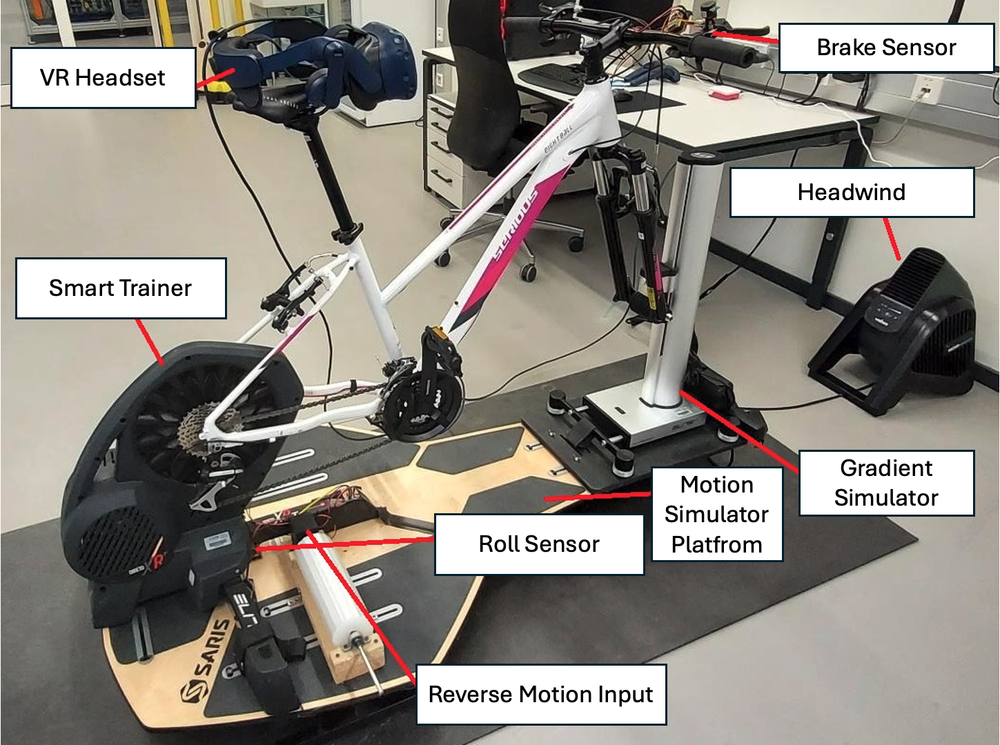
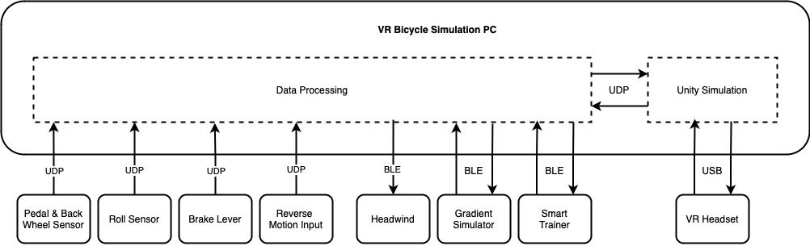
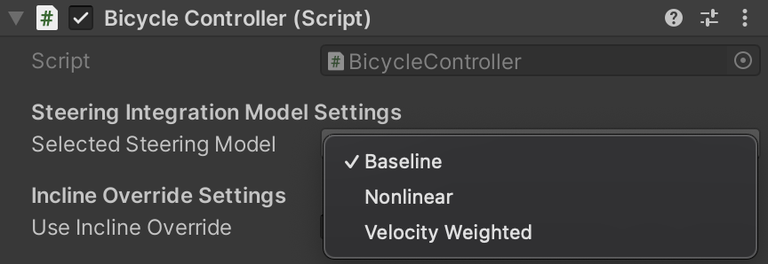
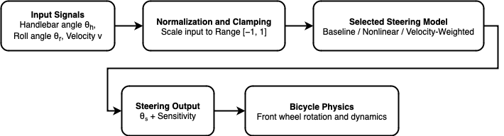
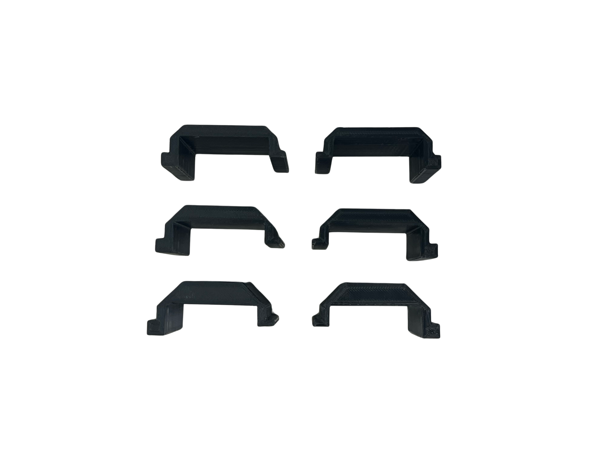
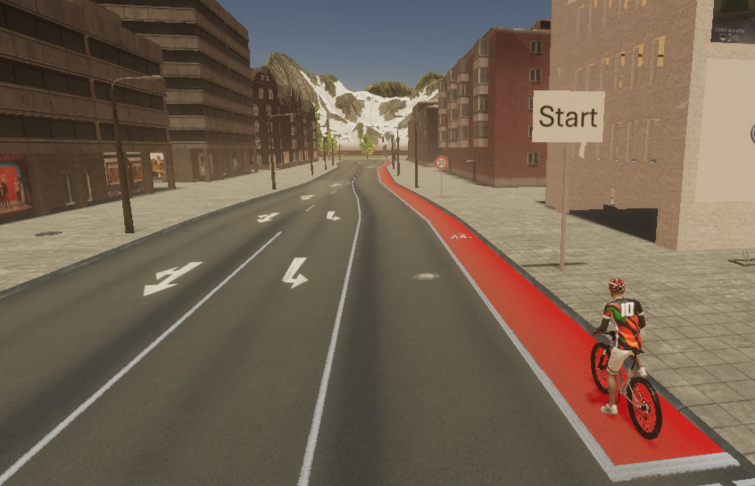
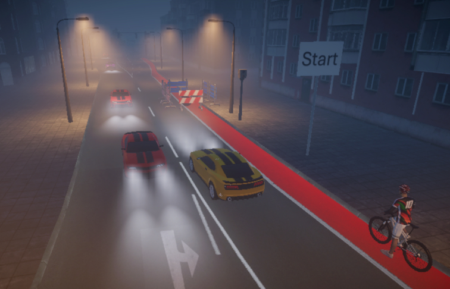
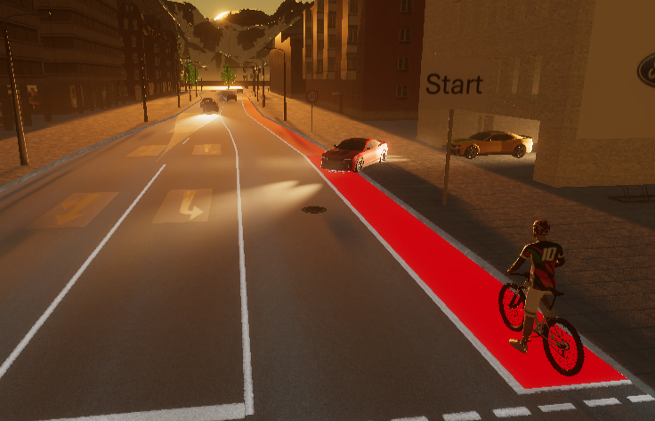
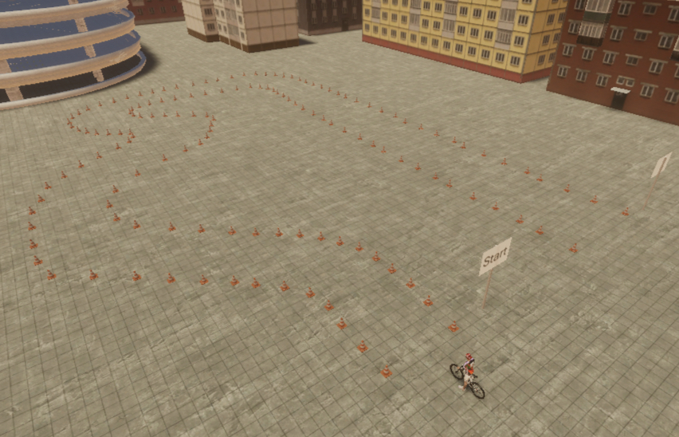

# VR Bicycle Simulator - UniTyLab HHN

A virtual reality bicycle simulator integrating physical hardware sensors and actuators with Unity-based VR simulation for traffic safety research and cyclist training. The system enables realistic cycling experiences by combining sensor data from a physical bicycle setup with immersive VR environments.



## Table of Contents
- [Project History](#project-history)
- [System Architecture](#system-architecture)
- [Quick Start Guide](#quick-start-guide)
- [Configuration Guide](#configuration-guide)
- [Unity Scenarios](#unity-scenarios)
- [Hardware Components](#hardware-components)
- [Development](#development)
- [Troubleshooting](#troubleshooting)
- [References](#references)

## Project History

This simulator has been developed through multiple iterations at Heilbronn University's UniTyLab:

- **Flaig et al. (2024-2025)**: Implemented foundational VR bicycle simulator with basic sensor-actuator pipeline and hardware architecture.
- **Student Project SS24 (Ramesh, Baumann, Senfft, Hessenauer)**: Created German urban traffic scenarios, improved Elite Rizer integration, and developed comprehensive use cases.
- **Baumann et al. (2025)**: Conducted first user study, improved custom steering angle sensor, identified reliability and realism issues.
- **Hessenauer et al. (2024)**: Added Hall Effect sensors for pedal and backwheel speed to dramatically reduce latency (~100ms vs ~1s).
- **Baumann Master Thesis (2025)**: Implemented passive tilt resistance mechanism with 3 adjustable stiffness levels, developed three steering integration models, and improved overall system reliability.

## System Architecture

The simulator uses a distributed UDP-based communication architecture with three main layers:



### Communication Flow

**Sensors → Unity (via master_collector.py)**:
- ESP32 sensors broadcast UDP to `192.168.0.101` (Desktop PC)
- BLE devices (Elite Direto XR, Rizer, Headwind) connect via Python scripts
- `master_collector.py` aggregates all inputs and sends JSON to Unity at `127.0.0.2:1337`

**Unity → Actuators (via master_receiver.py)**:
- Unity sends commands to `127.0.0.1:12345`
- `master_receiver.py` forwards to actuator scripts:
  - Elite Rizer incline: `127.0.0.3:2223`
  - Headwind fan: `127.0.0.3:2224`
  - Direto resistance: `127.0.0.3:2225`

### WiFi Network Configuration

All ESP32 sensors connect to:
- **SSID**: `Bicycle_Simulator_Network`
- **Password**: `17701266`
- **Target IP**: `192.168.0.101` (Desktop PC)

## Quick Start Guide

### Prerequisites

- Python 3.8+
- Unity 2021.3 LTS or newer
- HTC Vive Pro VR headset with SteamVR
- All hardware components powered on
- Desktop PC connected to `Bicycle_Simulator_Network` WiFi

### Environment Setup

#### Windows

```bash
# Clone the repository
git clone https://github.com/DaveBsns/BicycleSimulatorData.git
cd BicycleSimulatorData

# Create and activate virtual environment
python -m venv .env
source ./.env/Scripts/activate

# Install dependencies
pip install -r requirements.txt
```


### Running the Simulator

1. **Start the Data Collection System**:
   ```bash
   cd collector_scripts
   ./run_scripts.bat  # Windows
   ```

   The batch script will:
   - Control Tapo smart plug (starts simulator power)
   - Start BLE communication with Elite devices (Direto XR, Headwind, Rizer)
   - Launch `master_collector.py` (aggregates sensor data)
   - Launch `master_receiver.py` (receives Unity commands)

2. **Start Unity Simulation**:
   - Open the BicycleSimulator project in Unity
   - Load one of the Master Philipp scenarios (see [Unity Scenarios](#unity-scenarios))
   - Configure steering model and tilt resistance (see [Configuration Guide](#configuration-guide))
   - Press Play

3. **Put on VR Headset and Start Cycling**

> **Note**: If the simulator doesn't start automatically, manually turn on the Tapo smart plug.

## Configuration Guide

### Steering Models

The simulator offers three steering integration models that combine handlebar input (θh) and tilt/roll input (θr):



#### Available Models

1. **Baseline**: Uses only handlebar steering (θs = θh)
   - Recommended for users with cycling anxiety or minimal VR experience
   - Most predictable and easiest to control
   - Tilt has no effect on steering

2. **Nonlinear**: Adds nonlinear tilt component (θs = θh + α·sin(θr))
   - Moderate integration of tilt for enhanced realism
   - Good balance between control and immersion

3. **Velocity-Weighted**: Speed-dependent blending (θs = θh·w(v) + θr·(1-w(v)))
   - Emphasizes tilt at low speeds (balance-dominant)
   - Emphasizes handlebar at high speeds (kinematic steering)
   - Most realistic model for experienced cyclists

#### How to Configure

In Unity Inspector on the **BicycleController** component:
1. Locate **Steering Integration Model Settings**
2. Select `selectedSteeringModel` from dropdown:
   - `Baseline`
   - `Nonlinear`
   - `VelocityWeighted`



#### Recommendations for Beginners

- **Start with**: Velocity-Weighted model (most realistic)
- **Initial configuration**: Use stiff tilt resistance setting
- **Adjustment strategy**: If bicycle feels too difficult to control, reduce stiffness gradually (especially for lightweight riders < 65 kg)
- **For participants with cyclophobia**: Consider starting with Baseline model and stiff setting, then progress to Velocity-Weighted once comfortable
- **For research**: Velocity-Weighted with personalized stiffness provides most realistic behavior

### Tilt Resistance Settings

The simulator features a passive tilt resistance mechanism with 3 adjustable stiffness levels that affect how much force is required to tilt the bicycle platform:



#### Stiffness Levels

The stiffness is determined by pad height - higher (thicker) pads create stiffer resistance:

- **Low**: Thinner pads, easiest to tilt, minimal resistance (7.5mm)
- **Medium**: Medium-height pads, moderate resistance (10mm)
- **High**: Thickest pads, maximum resistance, requires more force to tilt (12.5mm)

Note: The higher the pad, the stiffer the complete setup becomes.

#### Body Weight Correlation

Research shows strong correlation between body weight and preferred stiffness (r = 0.630, p = 0.003):

- **< 65 kg**: Start with High stiffness, reduce to Medium/Low if too difficult
- **65-80 kg**: Start with High stiffness, may need to reduce to Medium
- **> 80 kg**: Start with High stiffness (likely optimal)

#### How to Adjust

**SAFETY WARNING**: Never reach under the bicycle while anyone is on or near it. Ensure the area is clear before adjusting pads.

1. **Preparation**: Ensure no one is on or near the bicycle
2. **Loosen carriage**: Loosen both hand screws on the carriage/sled (do NOT unscrew completely)
3. **Pull outward**: Pull the carriage all the way outward
4. **Open cover**: Undo the small hand screw on the front to open the cover
5. **Remove pad**: Take out the current pad (if present)
6. **Insert new pad**: Insert the replacement pad (always use matching pads on both sides)
   - **Orientation**: The thinner side of the pad should face OUTWARD
   - **Stiffness rule**: Thicker pad = stiffer setting; thinner pad = softer setting
7. **Close cover**: Secure the small hand screw on the front cover
8. **Retract carriage**: Push the carriage back in and tighten both hand screws
9. **Repeat**: Perform the same procedure on the other side with a matching pad

#### Recommendations for Beginners

- **First-time users**: Start with stiff (High) setting, then reduce if too difficult to control
- **Rationale**: Better to start too stiff than too soft - excessive wobble is harder to control than firm resistance
- **Personalization**: After initial trial, ask participant if bicycle feels "too stiff" (decrease stiffness)
- **Research finding**: Personalized settings outperformed baseline by 26% (d = 1.51, p = 0.0001)
- **For experiments**: Allow 2-3 minute familiarization ride before data collection

### Incline Override Settings

In the BicycleController component, you can enable dynamic incline adjustments based on braking and acceleration:

- **Enable**: Check `useInclineOverride` in Unity Inspector
- **Purpose**: Adds realistic incline feedback during hard braking (nose-down) and hard acceleration (nose-up)
- **Parameters**:
  - `brakeInclineStep`: Amount of incline change during braking (default: 3°)
  - `accelInclineStep`: Amount of incline change during acceleration (default: 1°)
  - `inclineResetSpeed`: How quickly incline returns to terrain value (default: 0.25)

## Unity Scenarios

The most recent scenarios are from the Master Thesis evaluation studies, located in `BicycleSimulator/Assets/Scenes/Master Philipp/`. Additional scenarios are available in `BicycleSimulator/Assets/Scenes/MRL Scenarios/` and `BicycleSimulator/Assets/Scenes/Research Project/` (used in the "What Drives the Ride" paper).

### Most Recent Scenarios (Master Philipp)

#### 1. Baseline (Safe Scenario)


- Urban environment with proper bicycle lanes
- Cars maintain safe distance and moderate speed
- Good weather, daylight conditions
- Recommended for: Familiarization, baseline measurements

#### 2. DangerScenario1 (Night with Fog)


- Nighttime with dense fog reducing visibility
- Construction site obstacles
- Oncoming cars with headlights
- Recommended for: Stress testing, safety research

#### 3. DangerScenario2 (Parking Garage)


- Sunset lighting (reduced visibility)
- Cars exiting parking garage asserting right-of-way
- Programmed to brake for cyclist but create stressful situations
- Recommended for: Decision-making research, stress evaluation

#### 4. Parameter (Scenario Variations)


- Configurable parameters for systematic testing
- Adjustable: lighting, traffic density, obstacle placement
- Recommended for: Controlled experiments, parameter studies

### Additional Scenarios

**MRL Scenarios** (from Student Project SS24) - Located in `BicycleSimulator/Assets/Scenes/MRL Scenarios/`:
- **Scenario 3**: Contains self-driving bicycles using `Simple Bicycle Physics1` package
  - Note: This is separate from the main `Simple Bicycle Physics` used for the simulator bike

**Research Project Scenarios** - Located in `BicycleSimulator/Assets/Scenes/Research Project/`:
- Scenarios used in the "What Drives the Ride" paper (Baumann et al. 2025)
- Earlier iteration of urban traffic scenarios

### How to Load and Run

1. Open Unity project
2. Navigate to `Assets/Scenes/Master Philipp/`
3. Double-click desired scenario
4. Configure BicycleController settings (see [Configuration Guide](#configuration-guide))
5. Ensure VR headset is connected and SteamVR is running
6. Press Play

## Hardware Components

The simulator integrates commercial and custom-built components:

### Commercial Devices (BLE)

- **Elite Direto XR-T**: Smart trainer for speed sensing and resistance control
- **Elite Rizer**: Front axle gradient simulator (±15°, handlebar position sensing)
- **Wahoo KICKR Headwind**: Fan for wind resistance simulation

### Custom Sensors (ESP32 + UDP)

- **Brake System**: Rotary encoder on brake lever
- **Reverse Drive**: AS5600 Hall Effect sensor on foot roller
- **Lean Sensor**: BNO055 IMU on rocker plate (roll angle)
- **Steering Sensor**: Photoelectrical encoder on fork (0.6° resolution)
- **Backwheel Sensor**: Hall Effect sensors with 5 magnets
- **Pedaling Sensor**: Hall Effect sensors with 4 magnets on pedals

### Support Hardware

- **Saris MP1 Platform**: Rocker plate for lateral movement
- **HTC Vive Pro**: VR headset with SteamVR base stations
- **Tapo P100 Smart Plug**: Automated power control

For detailed hardware specifications, see the respective project documentation in `documentation-and-papers/`.

## Development

### Building and Uploading ESP32 Firmware

Each sensor has its own PlatformIO project in `collector_scripts/sensor_scripts/`:

```bash
# Navigate to sensor directory (example: Gyro Sensor)
cd collector_scripts/sensor_scripts/Gyro_Sensor

# Build firmware
pio run

# Upload to ESP32
pio run --target upload

# Monitor serial output
pio device monitor
```

Available sensor projects:
- `Brake_Sensor/` - Brake lever angle measurement
- `Gyro_Sensor/` - BNO055 IMU (heading, roll, pitch)
- `Roll_Sensor/` - Roll angle measurement
- `Rotation_Sensor_1/` - Backwheel and pedal speed
- `Steering_Sensor/` - Steering angle measurement

### Sensor Data Format

All ESP32 sensors send JSON over UDP. Example formats:

```json
// Gyro/BNO055 (port 8888)
{"sensor": "BNO055", "euler_h": 12.5, "euler_r": -2.3, "euler_p": 1.8}

// Brake (port 7777)
{"angle": 45.2}

// Rotation (port 7778)
{"speed": 2.5, "pedal": 60.0}

// Roll (port 6666)
{"sensor_value": -5.3}

// Steering angle (port 8778)
{"angle": 15.7}
```

### BLE Device Configuration

#### Elite Direto XR-T
- **Device Name**: `DIRETO XR`
- **Service UUID**: `00001826-0000-1000-8000-00805f9b34fb`
- **Speed Characteristic** (notify): `00002ad2-0000-1000-8000-00805f9b34fb`
- **Resistance Characteristic** (write): `00002ad9-0000-1000-8000-00805f9b34fb`

#### Elite Rizer
- **Device UUID**: `fc:12:65:28:cb:44`
- **Service UUID**: `347b0001-7635-408b-8918-8ff3949ce592`
- **Steering Characteristic**: `347b0030-7635-408b-8918-8ff3949ce592`
- **Incline Characteristic**: `347b0020-7635-408b-8918-8ff3949ce592`
- **Incline Range**: -14 to +15

#### Wahoo KICKR Headwind
- **Device Name**: `HEADWIND BC55`
- **Service UUID**: `a026ee0c-0a7d-4ab3-97fa-f1500f9feb8b`
- **Control Characteristic**: `a026e038-0a7d-4ab3-97fa-f1500f9feb8b`
- **Speed Range**: 0-100 (0=off, 1=on/min speed, 2-100=actual speed)

### Adding New Sensors

1. Create ESP32 firmware sending JSON via UDP to `192.168.0.101`
2. Update `master_collector.py` to receive and parse new sensor data
3. Add sensor field to `BikeDataSO` scriptable object in Unity
4. Update `BicycleController.cs` to use new sensor input

## Troubleshooting

### BLE Connection Issues

**Problem**: Elite devices fail to connect

**Solutions**:
- Ensure Bluetooth is enabled in Windows/Linux settings
- Check that no other device is connected to Elite equipment
- Verify MAC addresses match actual hardware
- Restart BLE devices (power cycle)
- Check if Windows Update disabled Bluetooth (re-enable it)

### UDP Communication Issues

**Problem**: Sensor data not reaching Unity

**Solutions**:
- Verify firewall allows UDP on required ports (see port list in System Architecture section)
- Confirm ESP32 sensors connected to `Bicycle_Simulator_Network`
- Check target IP `192.168.0.101` matches desktop PC IP: `ipconfig` (Windows) or `ifconfig` (Linux)
- Test UDP reception: `nc -lu 192.168.0.101 7777` (listen on brake sensor port)

### Steering Feels Unresponsive

**Problem**: Bicycle doesn't respond well to handlebar or tilt input

**Solutions**:
- Check selected steering model (Baseline = handlebar only, others = combined)
- Verify ESP32 steering sensor is powered and sending data
- Check BNO055 gyro sensor is calibrated (stores offsets on startup)
- Try different steering model (start with Baseline for debugging)
- Inspect Unity Console for sensor data reception logs

### Braking Issues

**Problem**: Brake doesn't engage or feels unrealistic

**Solutions**:
- Check brake dead zone threshold (default: 7.5, full brake: 25)
- Verify brake sensor ESP32 is powered and sending UDP
- Inspect brake lever rotary encoder connection
- Check brake rim replacement 3D-printed part is properly installed
- Review `BicycleController.cs` brake logic (~line 455-492)

### Motion Sickness

**Problem**: Participants experience nausea or discomfort

**Solutions**:
- Reduce session duration (start with 5-10 min max)
- Allow 2-3 minute familiarization period before experiments
- Consider using Baseline steering model (most predictable)
- Check visual-vestibular synchronization (delays cause sickness)
- Adjust tilt resistance to match participant preference
- Ensure smooth frame rate (90 Hz for HTC Vive Pro)

### Power Supply Issues

**Problem**: ESP32 sensors reboot or behave erratically

**Solutions**:
- All ESP32 sensors use independent USB power supplies for maximum stability
- Ensure each ESP32 has its own dedicated power source (avoid shared power supplies)
- If experiencing issues, check USB cable quality and connection integrity
- Historical reference: Earlier versions used shared supplies - see documentation in `documentation-and-papers/` for evolution of power supply design

### Platform Tilt Calibration

**Problem**: Bicycle leans unexpectedly or doesn't return to neutral

**Solutions**:
- BNO055 gyro calibrates on startup - ensure bike is level when powered on
- Check rocker plate resistance pads are properly installed and symmetric
- Verify BNO055 sensor is securely mounted (no vibrations)
- Test sensor output in isolation: `pio device monitor` in `Gyro_Sensor/`

## References

### Documentation and Publications

All project documentation and publications are available in the `documentation-and-papers/` folder:

- **Flaig et al. (2025)**: "Implementing a VR-Enabled Bicycle Simulator: Integrating Physical Sensor and Actuator Data for a Realistic Simulation Experience" - IHCI 2024 Conference
- **Baumann et al. (2025)**: "What Drives the Ride? Assessing Factors of Immersion and Emotion in Virtual Reality Bicycle Simulations" (submitted)
- **Baumann (2025)**: "Enhancing a VR Bicycle Simulator by Realistically Integrating Tilt Dynamics into Steering and Balance Control" - Master's Thesis, Heilbronn University
- **Student Project Documentation (2024)**: SS24 project details and implementation
- **Hessenauer (2024)**: "Adding Hall-Effect Sensors to Track Speed for Bicycle Simulation" - RTS Project Documentation

### Hardware Documentation

- Elite Direto XR-T: https://www.elite-it.com/en/products/home-trainers/direto-series
- Elite Rizer: https://www.elite-it.com/en/products/home-trainers/accessories/rizer
- Wahoo KICKR Headwind: https://www.wahoofitness.com/devices/indoor-cycling/accessories/kickr-headwind
- HTC Vive Pro: https://www.vive.com/us/product/vive-pro/
- BNO055 IMU: https://www.bosch-sensortec.com/products/smart-sensor-systems/bno055/
- ESP32 DevKit: https://www.espressif.com/en/products/socs/esp32

### Unity Assets

- Simple Bicycle Physics: https://assetstore.unity.com/packages/tools/physics/simple-bicycle-physics-206818
  - Note: Two versions exist in the project:
    - `Simple Bicycle Physics/` - Modified for simulator bike
    - `Simple Bicycle Physics1/` - Unmodified for NPC cyclists (Scenario 3)

### Additional Resources

- **Hardware CAD Files**: See `hardware/` directory for 3D-printable mounts and sensor housings
- **Sensor Firmware**: See `collector_scripts/sensor_scripts/` for ESP32 code
- **Complete Documentation**: See `documentation-and-papers/` folder for all project documents
